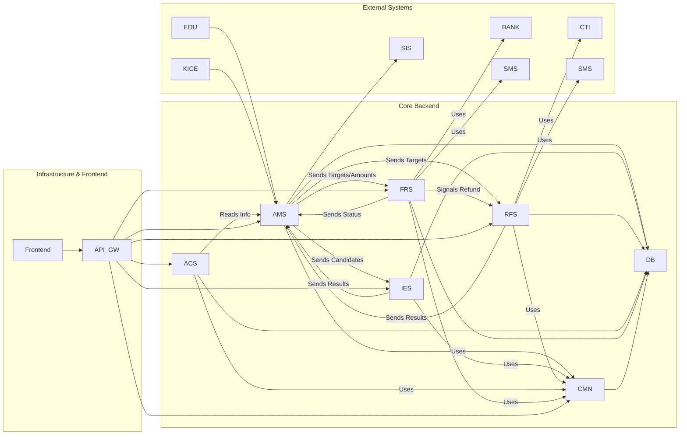

Okay, let's break down the program design for the "통합 입학 관리 시스템" and create a parallel Sprint development plan for two developers.

**① 모듈 요약**

*   **AMS (입학관리시스템):** 핵심 모듈. 원서접수부터 학사 이관까지 전 과정을 관리하며, 타 시스템 데이터 허브 역할. (AMS-REQ-001 ~ AMS-REQ-028)
*   **IES (면접·실기 평가시스템):** 현장 평가 지원. 출석, 가번호 부여, 평가 입력/집계 담당. (IES-REQ-001 ~ IES-REQ-015)
*   **RFS (녹취·충원관리 시스템):** 충원 대상자 연락 및 관리. CTI/SMS 연동, 녹취, 충원 현황 관리. (RFS-REQ-001 ~ RFS-REQ-014)
*   **ACS (입학상담 솔루션):** 대외 상담 지원. 모집요강 정보 제공, 성적 기반 상담, 통계 관리. (ACS-REQ-001 ~ ACS-REQ-009)
*   **FRS (등록금 수납·환불 시스템):** 재무 처리. 가상계좌, 실시간 수납/환불, 금융기관 연동. (FRS-REQ-001 ~ FRS-REQ-004)
*   **CMN (공통):** 시스템 전반의 공통 기능 제공. 수험생 조회, 공통 코드, 인증/인가 등. (CMN-REQ-001, CMN-REQ-002)
*   **DB (데이터베이스):** PostgreSQL 기반 데이터 영속성 계층.
*   **Frontend (UI):** React/TypeScript 기반 사용자 인터페이스.
*   **API Gateway:** 백엔드 서비스들의 단일 진입점.
*   **External:** 외부 연동 시스템 (학사, 교육행정, 평가원, 은행, SMS, CTI).

**② 모듈 간 의존성 맵**

*   **핵심 의존성:**
    *   모든 백엔드 모듈은 **DB**와 **CMN**에 의존.
    *   **AMS**는 입학 절차의 중심축으로, IES, RFS, FRS와 밀접하게 데이터를 주고받음.
    *   IES, RFS, FRS는 **AMS**로부터 대상자 정보를 받아 처리 결과를 다시 AMS로 전달.
    *   FRS의 환불 처리는 **RFS**의 충원 프로세스를 트리거할 수 있음.
    *   외부 시스템 연동은 각 담당 모듈(AMS, RFS, FRS)에서 처리.

**③ 최적 개발 순서**

1.  **Foundation (DB & CMN):** DB 스키마 설계 및 구축, 공통 코드 관리, 기본 사용자 인증/인가 프레임워크 (CMN). 이것 없이는 다른 모듈 개발 불가.
2.  **Core Application Entry (AMS - 원서접수):** 수험생 데이터의 시작점. 기본 원서 접수 및 데이터 검증 기능 구현 (AMS).
3.  **External Data Integration (AMS - 학생부/수능):** 원서 접수 후 필요한 외부 성적 데이터 연동 (AMS).
4.  **Evaluation Setup & Execution (IES & AMS):** 평가 환경 설정(IES), 평가 기준 관리(AMS), 현장 평가 입력(IES), 결과 연동(IES->AMS).
5.  **Decision Making (AMS):** 평가 결과를 바탕으로 사정 및 합격자 선발 로직 구현 (AMS).
6.  **Payment & Registration (FRS & AMS):** 합격자 대상 등록금 고지(AMS), 가상계좌 발급 및 수납 처리(FRS), 수납 결과 연동(FRS->AMS).
7.  **Recruitment (RFS & AMS & FRS):** 미등록/환불 발생 시 충원 대상자 선정(AMS), 전화/SMS 통한 충원 진행(RFS), 결과 연동(RFS->AMS), 환불 처리(FRS) 및 연계(FRS->RFS/AMS).
8.  **Counseling (ACS):** 비교적 독립적인 상담 기능 구현. 모집 요강, 학과 정보 연동 필요 (ACS<-AMS/CMN).
9.  **Finalization (AMS):** 최종 등록자 확정 및 학사 시스템 이관 (AMS->SIS).
10. **Integration & UI:** API Gateway 설정, Frontend 개발 및 백엔드 연동.

**④ Sprint 계획표 (2명 병렬, 모듈 담당자 고정 포함)**

*   **개발자 A:** 주로 핵심 프로세스(AMS) 및 연관 모듈(FRS) 담당
*   **개발자 B:** 주로 지원/독립 모듈(CMN, IES, RFS, ACS) 담당

---

• **Sprint 1**
- **목표:** 시스템 기반 구축 (DB 스키마 및 공통 코드 관리)
- **투입 인원 수:** 2명
- **병렬 작업:**
    - **작업 1:** DB / 주요 엔터티 스키마 설계 및 초기 생성 (ERD 기반) / **개발자 A** (DB 담당 시작)
    - **작업 2:** CMN / 공통 코드 관리 API (CRUD) 및 기본 구조 / **개발자 B** (CMN 담당 시작)
- **산출물:** 기본 DB 테이블 구조, 공통 코드 관리 API (테스트 완료)

• **Sprint 2**
- **목표:** 사용자 인증 및 원서 접수 기능 프로토타입 구현
- **투입 인원 수:** 2명
- **병렬 작업:**
    - **작업 1:** AMS / 원서 접수 API 기본 (수험생 정보 입력/저장), 데이터 유효성 검증 로직 / **개발자 A** (AMS 담당 시작)
    - **작업 2:** CMN / 사용자 인증/인가 기본 (로그인, 역할 기반 접근 제어 stub) / **개발자 B** (CMN 담당 지속)
- **산출물:** 원서 접수 API (기본 CRUD), 로그인 API 프로토타입, DB 저장 확인

• **Sprint 3**
- **목표:** 외부 데이터 연동 및 평가 환경 설정 시작
- **투입 인원 수:** 2명
- **병렬 작업:**
    - **작업 1:** AMS / 학생부/수능 데이터 업로드 및 반영 로직 (AMS-REQ-003, 004) / **개발자 A** (AMS 담당 지속)
    - **작업 2:** IES / 평가 환경 설정 (모집시기/전형별 설정, 평가항목/등급 설정) (IES-REQ-006, 008) / **개발자 B** (IES 담당 시작)
- **산출물:** 학생부/수능 데이터 처리 모듈, IES 환경설정 화면 및 API

• **Sprint 4**
- **목표:** 평가 관리 기준 설정 및 면접/실기 출석 관리 기능 구현
- **투입 인원 수:** 2명
- **병렬 작업:**
    - **작업 1:** AMS / 평가 관리 (수능/학생부 점수 반영 기준, 서류 평가 요소 관리) (AMS-REQ-006, 007) / **개발자 A** (AMS 담당 지속)
    - **작업 2:** IES / 출석 관리 (바코드/QR 확인, 가번호 부여, 조배정 로직) (IES-REQ-001~003, 009) / **개발자 B** (IES 담당 지속)
- **산출물:** AMS 평가 기준 설정 기능, IES 출석 및 가번호 관리 기능 (테스트 완료)

• **Sprint 5**
- **목표:** 면접/실기 평가 입력 기능 구현 및 사정 관리 준비
- **투입 인원 수:** 2명
- **병렬 작업:**
    - **작업 1:** AMS / 사정 관리 준비 (평가요소 배점 관리 API, 점수 계산 로직 stub) (AMS-REQ-011, 013 일부) / **개발자 A** (AMS 담당 지속)
    - **작업 2:** IES / 평가 수행 (실시간 평가 입력, 특이사항 처리, 결과 전송 API) (IES-REQ-011, 012, IES->AMS 연동) / **개발자 B** (IES 담당 지속)
- **산출물:** IES 평가 입력 및 결과 전송 기능 완료, AMS 배점 관리 API 기본

• **Sprint 6**
- **목표:** 사정 관리 핵심 로직 구현 및 등록금 관리 시스템 시작
- **투입 인원 수:** 2명
- **병렬 작업:**
    - **작업 1:** AMS / 사정 관리 (평가 점수 합산, 최종 배점 적용, 사정 결과 생성) (AMS-REQ-013 완료, 014) / **개발자 A** (AMS 담당 지속)
    - **작업 2:** FRS / 등록금 수납 준비 (가상계좌 발급 연동 API 설계, 등록 대상자 정보 연동 from AMS) (FRS-REQ-002 준비, AMS->FRS 연동) / **개발자 B** (FRS 담당 시작)
- **산출물:** AMS 사정 처리 로직 완료, FRS 가상계좌 연동 인터페이스 정의

• **Sprint 7**
- **목표:** 합격자 관리 및 등록금 수납 처리 구현
- **투입 인원 수:** 2명
- **병렬 작업:**
    - **작업 1:** AMS / 합격자 관리 (데이터 확정/보정, 합격자 발표 데이터 생성, 등록 데이터 생성) (AMS-REQ-015, 016, 017) / **개발자 A** (AMS 담당 지속)
    - **작업 2:** FRS / 실시간 수납 처리 (금융기관 연동(펌뱅킹), 입금 확인 로직, SMS 통보, DB 연동) (FRS-REQ-001) / **개발자 B** (FRS 담당 지속)
- **산출물:** AMS 합격자 관리 기능, FRS 실시간 수납 처리 및 결과 연동(->AMS) 완료

• **Sprint 8**
- **목표:** 등록금 고지서 및 충원 시스템 연동 준비
- **투입 인원 수:** 2명
- **병렬 작업:**
    - **작업 1:** AMS / 등록 업무 지원 (등록금 고지서 생성 로직, 명부 관리 기초) (AMS-REQ-021, 023 일부) / **개발자 A** (AMS 담당 지속)
    - **작업 2:** RFS / 충원 시스템 기본 설정 (데이터 연동(AMS), 전형/차수별 서비스 생성) (RFS-REQ-001, 006) / **개발자 B** (RFS 담당 시작)
- **산출물:** AMS 등록금 고지서 생성 기능, RFS 기본 설정 및 AMS 데이터 연동 확인

• **Sprint 9**
- **목표:** 충원 시스템 핵심 기능 (전화/녹취) 구현 및 환불 처리 시작
- **투입 인원 수:** 2명
- **병렬 작업:**
    - **작업 1:** FRS / 환불 처리 시작 (환불 신청 접수 API, DB 연동) (FRS-REQ-003 일부) / **개발자 A** (FRS 담당 시작 - AMS 주요 기능 완료 후 FRS 담당 시작)
    - **작업 2:** RFS / 상담사 기능 (클릭콜/녹취 연동(CTI), SMS 발송, 결과 저장) (RFS-REQ-002, 003, 004) / **개발자 B** (RFS 담당 지속)
- **산출물:** RFS 전화/녹취/SMS 발송 및 결과 저장 기능, FRS 환불 신청 API

• **Sprint 10**
- **목표:** 충원 관리 기능 및 환불 승인 프로세스 구현
- **투입 인원 수:** 2명
- **병렬 작업:**
    - **작업 1:** FRS / 환불 승인 처리 및 연계 (관리자 승인 로직, 충원 연계 신호 to RFS/AMS) (FRS-REQ-003 완료, 004) / **개발자 A** (FRS 담당 지속)
    - **작업 2:** RFS / 관리자 기능 및 충원 로직 (검색/필터, 통계, 교차지원 조정 로직) (RFS-REQ-007~012) / **개발자 B** (RFS 담당 지속)
- **산출물:** FRS 환불 전체 프로세스 완료, RFS 관리 및 충원 핵심 로직 완료

• **Sprint 11**
- **목표:** 입학 상담 솔루션(ACS) 개발 시작 및 학사 이관 준비
- **투입 인원 수:** 2명
- **병렬 작업:**
    - **작업 1:** AMS / 학사 이관 기능 (학번 부여 로직, 학사 연계 데이터 생성) 및 보고서 (AMS-REQ-027, 028) / **개발자 A** (AMS 담당 마무리)
    - **작업 2:** ACS / 정보 제공 기능 (모집요강/학과 정보 API, 상담 신청/성적 입력 화면) (ACS-REQ-001~003) / **개발자 B** (ACS 담당 시작)
- **산출물:** AMS 학사 이관 데이터 생성 기능, ACS 기본 정보 조회 및 상담 신청 화면

• **Sprint 12**
- **목표:** 입학 상담 솔루션(ACS) 핵심 기능 구현 및 공통 기능 마무리
- **투입 인원 수:** 2명
- **병렬 작업:**
    - **작업 1:** CMN / 통합 조회 및 데이터 요청 처리 (CMN-REQ-001, 002), 최종 점검 / **개발자 A** (CMN 담당 시작)
    - **작업 2:** ACS / 맞춤 상담 및 통계 (성적 기반 상담 로직, 시각화, 통계) (ACS-REQ-004~006) / **개발자 B** (ACS 담당 지속)
- **산출물:** CMN 통합 조회 기능, ACS 맞춤 상담 및 통계 기능 완료

• **Sprint 13**
- **목표:** API Gateway 통합 및 Frontend 연동 시작
- **투입 인원 수:** 2명
- **병렬 작업:**
    - **작업 1:** API Gateway / 백엔드 서비스 라우팅 설정 및 통합 테스트 / **개발자 A** (인프라/통합 담당)
    - **작업 2:** Frontend / 주요 화면 (원서접수, 합격확인 등)과 API 연동 / **개발자 B** (Frontend 연동 시작)
- **산출물:** API Gateway 통한 백엔드 서비스 호출 확인, 주요 기능 Frontend 연동 프로토타입

• **Sprint 14**
- **목표:** 시스템 통합 테스트 및 안정화
- **투입 인원 수:** 2명
- **병렬 작업:**
    - **작업 1:** 전체 시스템 / E2E 테스트 시나리오 기반 통합 테스트 수행 및 버그 수정 / **개발자 A** (통합 테스트 리드)
    - **작업 2:** 전체 시스템 / 테스트 지원, 문서화 검토 및 보완 / **개발자 B** (테스트 지원 및 문서화) - (병렬 작업 성격보다는 협업)
- **산출물:** 통합 테스트 결과 보고서, 최종 시스템 산출물 (버전 1.0)

---
**담당자 요약:**
*   **개발자 A:** DB(S1), AMS(S2-S8, S11, S13), FRS(S9-S10), CMN(S12), 통합(S13-S14)
*   **개발자 B:** CMN(S1-S2), IES(S3-S5), FRS(S6-S7), RFS(S8-S10), ACS(S11-S12), Frontend 연동(S13), 테스트/문서화(S14)

*(참고: 실제 프로젝트에서는 Sprint 진행 중 발견되는 이슈나 변경사항에 따라 계획이 조정될 수 있습니다. 위 계획은 초기 설계 기반의 최적화된 제안입니다.)*